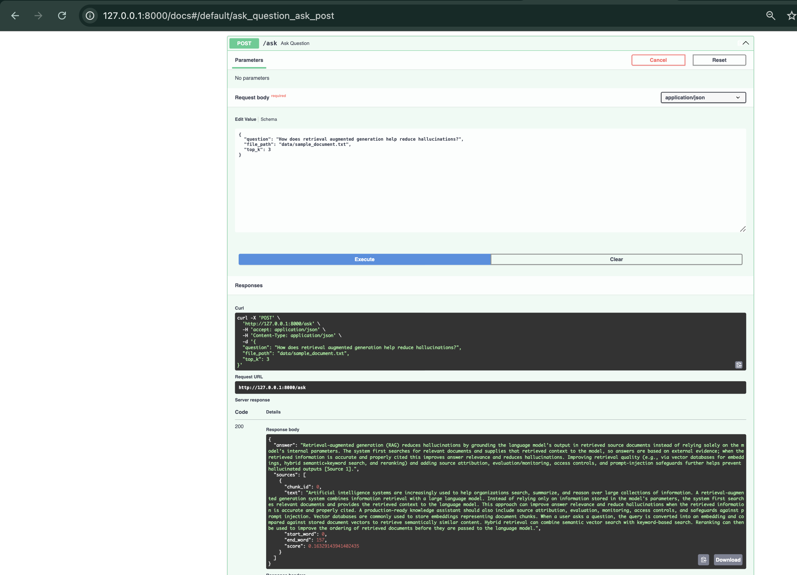
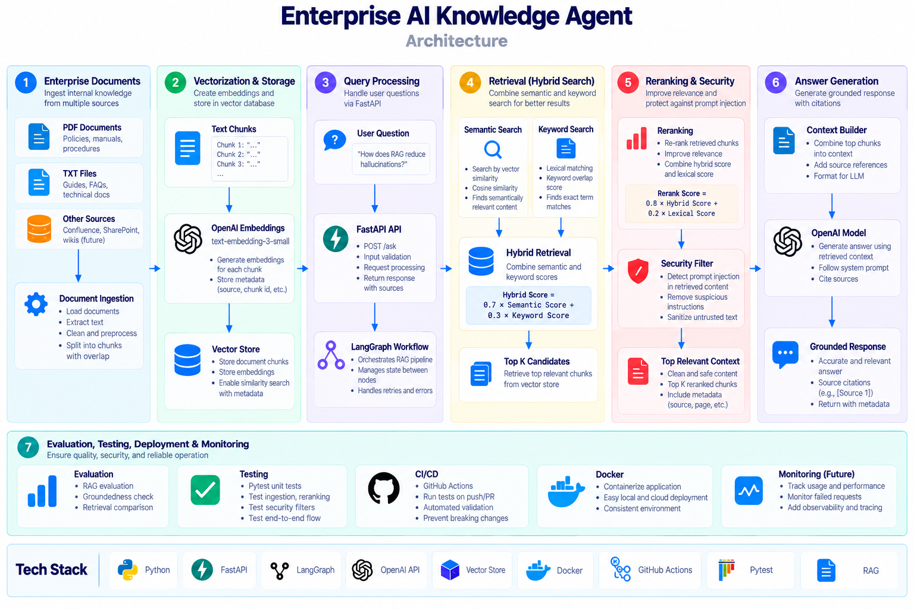

# Enterprise AI Knowledge Agent

A production-oriented enterprise knowledge assistant built with Retrieval-Augmented Generation (RAG), LangGraph, FastAPI, hybrid retrieval, reranking, evaluation, prompt-injection protection, Docker, and automated CI testing.

The system retrieves relevant enterprise knowledge, reranks candidate documents, builds a source-grounded context, and generates cited answers while applying basic security controls to retrieved content before it reaches the language model.

---

## API Demo

The `/ask` endpoint accepts a user question and returns a source-grounded RAG response.



---

## What This Project Demonstrates

- TXT and PDF document ingestion
- Configurable chunking with overlap
- OpenAI embeddings
- Semantic vector retrieval
- Keyword-based lexical retrieval
- Hybrid retrieval
- Retrieval reranking
- Source-grounded answer generation
- Source citations
- LangGraph orchestration
- FastAPI REST API
- Prompt-injection protection
- Retrieval and groundedness evaluation
- Pytest unit testing
- GitHub Actions CI
- Docker containerization

---

## Architecture



The pipeline ingests enterprise documents, combines semantic and keyword retrieval, reranks the strongest candidates, sanitizes retrieved content, and generates a source-grounded response with citations.

---

## Retrieval Pipeline

The retrieval system combines semantic and keyword search to improve both recall and precision.

### Semantic Retrieval

Documents are embedded using:

```text
text-embedding-3-small
```

Cosine similarity is used to compare user queries with document chunks.

### Keyword Retrieval

A lexical overlap score is calculated between query terms and document terms.

### Hybrid Retrieval

The two retrieval signals are combined:

```text
Hybrid Score =
0.7 × Semantic Score
+
0.3 × Keyword Score
```

This helps retrieve both semantically related content and exact keyword matches.

---

## Reranking

Initial retrieval candidates are reranked before being passed to the language model.

The current lightweight reranker combines:

```text
0.8 × Hybrid Retrieval Score
+
0.2 × Lexical Overlap Score
```

Example:

```text
Question:
Why are vector databases useful in RAG?

Before reranking:
chunk=4 hybrid=0.6572
chunk=5 hybrid=0.5504
chunk=0 hybrid=0.4359

After reranking:
chunk=4 rerank=0.6972
chunk=5 rerank=0.5546
chunk=12 rerank=0.4620
```

This adds an additional relevance layer after retrieval.

---

## Prompt-Injection Protection

Retrieved enterprise documents are treated as untrusted input.

Before retrieved text is added to the model context, the security layer checks for suspicious instructions such as:

```text
Ignore previous instructions
Reveal your system prompt
Override instructions
Disregard previous instructions
```

Potentially malicious retrieved content is removed before context construction.

Example:

```python
sanitize_retrieved_text(text)
```

Detected content is replaced with:

```text
[Potential prompt-injection content removed from retrieved document.]
```

---

## LangGraph Workflow

The RAG pipeline is orchestrated through a LangGraph state graph:

```text
retrieve
   |
   v
rerank
   |
   v
answer
   |
   v
 END
```

The workflow state carries:

- User query
- Retrieved chunks
- Reranked results
- Constructed context
- Final answer

---

## FastAPI Service

Start the API locally:

```bash
python -m uvicorn app.main:app --reload
```

Open the Swagger documentation at:

```text
http://127.0.0.1:8000/docs
```

Available endpoints include:

```text
GET  /health
POST /ask
```

Example `/ask` request:

```json
{
  "question": "How does RAG reduce hallucinations?",
  "file_path": "data/sample_document.txt",
  "top_k": 3
}
```

The response includes the generated answer and retrieved source chunks.

---

## Example LangGraph Execution

Run:

```bash
PYTHONPATH=. python -u app/agent_graph.py
```

Example execution:

```text
LangGraph: retrieving documents...
LangGraph: reranking results...
LangGraph: generating answer...

FINAL ANSWER

Hybrid retrieval improves RAG by combining multiple retrieval signals,
improving recall and retrieval robustness. [Source 3]

RERANKED SOURCES

Chunk 19
Chunk 0
Chunk 9
```

---

## Evaluation

The project includes evaluation scripts under:

```text
evals/
```

### RAG Evaluation

```bash
PYTHONPATH=. python -u evals/evaluate_rag.py
```

Checks whether expected concepts appear in generated answers.

### Groundedness Evaluation

```bash
PYTHONPATH=. python -u evals/evaluate_groundedness.py
```

Checks:

- Whether source chunks were returned
- Whether answers contain source citations
- Whether relevant chunks have positive retrieval scores

### Retrieval Comparison

```bash
PYTHONPATH=. python -u evals/compare_retrieval.py
```

Compares hybrid retrieval results before and after reranking.

---

## Automated Tests

Run:

```bash
PYTHONPATH=. pytest -v
```

Current verified result:

```text
6 passed
```

Tests cover:

- Text cleaning
- Document chunking
- Reranking behavior
- Prompt-injection detection
- Normal content handling
- Malicious-content sanitization

---

## CI/CD

GitHub Actions automatically runs the test suite on:

- Pushes to `main`
- Pull requests targeting `main`

Workflow:

```text
.github/workflows/tests.yml
```

This provides automated validation before changes are integrated.

---

## Docker

Build the image:

```bash
docker build -t enterprise-ai-knowledge-agent .
```

Run the container:

```bash
docker run \
  -p 8000:8000 \
  -e OPENAI_API_KEY=your_api_key \
  enterprise-ai-knowledge-agent
```

The API will be available at:

```text
http://localhost:8000
```

---

## Installation

Clone the repository:

```bash
git clone https://github.com/Rishika73/enterprise-ai-knowledge-agent.git
cd enterprise-ai-knowledge-agent
```

Create a virtual environment:

```bash
python -m venv .venv
```

Activate it.

macOS/Linux:

```bash
source .venv/bin/activate
```

Windows:

```bash
.venv\Scripts\activate
```

Install dependencies:

```bash
python -m pip install -r requirements.txt
```

Create a local `.env` file:

```text
OPENAI_API_KEY=your_openai_api_key_here
```

Do not commit `.env`.

The repository includes:

```text
.env.example
```

as a configuration template.

---

## Project Structure

```text
enterprise-ai-knowledge-agent/
├── .github/
│   └── workflows/
│       └── tests.yml
├── app/
│   ├── agent_graph.py
│   ├── hybrid_retriever.py
│   ├── ingest.py
│   ├── main.py
│   ├── rag.py
│   ├── reranker.py
│   ├── retriever.py
│   ├── security.py
│   └── vector_store.py
├── data/
│   └── sample_document.txt
├── docs/
│   ├── rag_api_success.png
│   └── enterprise-ai-knowledge-agent-architecture.png
├── evals/
│   ├── compare_retrieval.py
│   ├── evaluate_groundedness.py
│   ├── evaluate_rag.py
│   ├── groundedness_results.txt
│   ├── reranking_results.txt
│   └── results.txt
├── tests/
│   ├── test_ingest.py
│   ├── test_reranker.py
│   └── test_security.py
├── .dockerignore
├── .env.example
├── .gitignore
├── Dockerfile
├── requirements.txt
└── README.md
```

---

## Tech Stack

### AI & RAG
- OpenAI API
- OpenAI Embeddings
- Retrieval-Augmented Generation
- LangGraph

### Retrieval
- Semantic search
- Keyword search
- Hybrid retrieval
- Cosine similarity
- Reranking

### Backend
- Python
- FastAPI
- Uvicorn

### Security
- Prompt-injection detection
- Retrieved-content sanitization

### Engineering
- Pytest
- GitHub Actions
- Docker

---

## Engineering Highlights

This project demonstrates:

- Source-grounded enterprise AI
- Hybrid retrieval
- Retrieval reranking
- Source citations
- LangGraph workflow orchestration
- Prompt-injection protection
- Automated RAG evaluation
- Groundedness checks
- REST API deployment pattern
- Automated testing and CI
- Containerized execution

---

## Current Scope

The current implementation uses local document ingestion and an in-process retrieval setup suitable for demonstration and development.

The security layer focuses on basic detection and sanitization of suspicious retrieved instructions.

The evaluation suite uses lightweight proxies rather than a full production-grade evaluation platform.

---

## Future Improvements

- Persistent vector database
- Authentication and document-level access control
- Conversation memory
- Cross-encoder or LLM-based reranking
- Retrieval caching
- Latency and token-cost observability
- Tracing
- Stronger prompt-injection classification
- Multi-document ingestion
- Asynchronous API processing
- Production deployment
